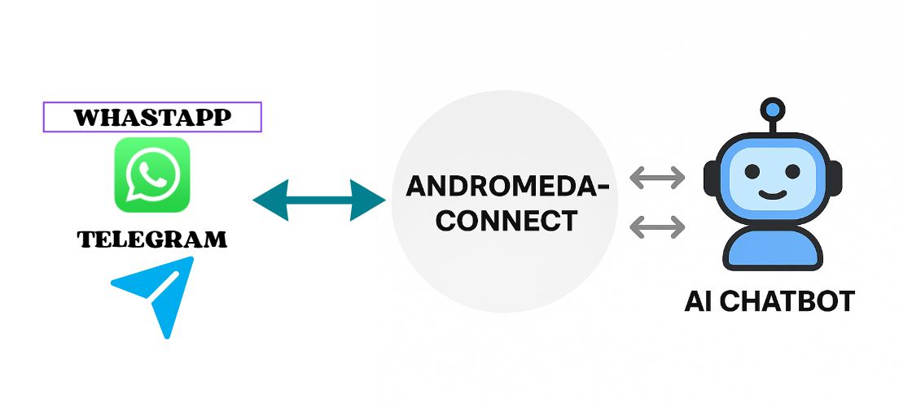

   

# Andromeda Connect

**WordPress Plugin** for WhatsApp & Telegram AI Integration

**Version:** 0.1.3  
**License:** GPLv2 or later  
**Text Domain:** andromeda-connect  
**Requires WordPress:** 5.8+  
**Requires PHP:** 7.4+

Connect WhatsApp (Meta Cloud API) and Telegram webhooks to AI chat providers for automated replies with logging and mapping controls.

## Description

Delight your customers with instant answers where they already are. Andromeda Connect turns your WhatsApp Business (Cloud API) and Telegram bot into an AI-powered support channel for your WordPress site, store, or blog.

Map each WhatsApp phone number (phone_number_id) or Telegram endpoint to an AI bot, then let the plugin auto-reply on your behalf. Every conversation is logged so you can review activity anytime.

### What you can do
* Auto-reply on WhatsApp and Telegram using your preferred AI provider (Axiachat AI, AI Engine, or AIPKit).
* Map each number/endpoint to a specific bot (per-channel, per-phone mapping).
* Fine-tune provider behavior: response timeout, "Fast Ack" quick reply, and fallback on timeout.
* See everything: unified logs (incoming/outgoing), conversation detail view, and basic stats per day/phone.
* Safer operations: token-expiry detection (Meta Graph code 190) and short transient backoff.
* Extend to your needs with hooks/filters. Fully internationalized; POT file included.

### How it works
1. A webhook receives the message (WhatsApp: Meta Cloud API; Telegram: Bot API webhook).
2. The service picks the mapped bot/provider for that number/endpoint and asks it for a reply.
3. A short optional "Fast Ack" can be sent immediately while the full answer is generated.
4. The final reply is sent back to the user and everything is logged for review.

### Supported providers
* **Axiachat AI** (recommended)
* **AI Engine** (Meow)
* **AIPKit** (REST provider)

This plugin is not affiliated with or endorsed by Meta or Telegram. Use according to the platforms' terms and obtain any required user consent.

## Quick Start (2 minutes)

### WhatsApp
1. Go to Mappings → Add. Channel: WhatsApp. Endpoint ID: your phone_number_id. Paste your access token and set a Verify Token.
2. Copy the webhook URL shown and paste it in your Meta App (Cloud API) with the same Verify Token.
3. Send a message to your WA number and check Logs.

### Telegram
1. Create a bot with @BotFather and copy the bot token.
2. Go to Mappings → Add. Channel: Telegram. Endpoint ID: friendly label. Specific Token: your bot token.
3. Click the generated setWebhook link, then send a message to your bot and check Logs.

## Installation

### From WordPress.org (Recommended)
1. Log in to your WordPress admin dashboard.
2. Navigate to **Plugins → Add New**.
3. Search for "Andromeda Connect".
4. Click **Install Now**, then **Activate**.

### Manual Installation
1. Download the plugin ZIP file.
2. Go to **Plugins → Add New → Upload Plugin**.
3. Choose the ZIP file and click **Install Now**.
4. Click **Activate Plugin**.

### From GitHub
1. Clone or download this repository.
2. Upload the `andromeda-connect` folder to `/wp-content/plugins/` via FTP or your hosting file manager.
3. Navigate to **Plugins** in your WordPress admin.
4. Find "Andromeda Connect" and click **Activate**.

## Setup & Configuration

After activation:

1. Go to **Andromeda Connect → Mappings** in your WordPress admin sidebar.
2. Click **Add New Mapping**.

### WhatsApp Setup
1. In the mapping form:
   - **Channel:** Select "WhatsApp"
   - **Endpoint ID:** Enter your Meta `phone_number_id`
   - **Specific Token:** Paste your WhatsApp access token
   - **Verify Token:** Create a secure string (you'll need this in Meta)
   - **Bot Slug:** Enter your AI bot identifier
   - **Provider:** Select your AI provider (Axiachat AI, AI Engine, or AIPKit)
2. Save the mapping and copy the **Webhook URL** shown.
3. In your Meta App Dashboard (Cloud API):
   - Navigate to WhatsApp → Configuration → Webhook
   - Paste the Webhook URL
   - Enter the same Verify Token
   - Subscribe to `messages` events
4. Send a test message to your WhatsApp Business number.
5. Check **Andromeda Connect → Logs** to verify the message was received and replied to.

### Telegram Setup
1. Create a bot with [@BotFather](https://t.me/botfather) on Telegram and copy the bot token.
2. In the mapping form:
   - **Channel:** Select "Telegram"
   - **Endpoint ID:** Enter a friendly identifier (e.g., "support-bot")
   - **Specific Token:** Paste your Telegram bot token
   - **Bot Slug:** Enter your AI bot identifier
   - **Provider:** Select your AI provider
3. Save the mapping.
4. Click the **setWebhook link** generated in the mapping list.
5. Send a test message to your Telegram bot.
6. Check **Andromeda Connect → Logs** to verify the conversation.

### Optional: Provider Configuration
- Go to **Andromeda Connect → Providers** to fine-tune:
  - Response timeout (ms)
  - Fast Ack (instant acknowledgment message)
  - Timeout actions (silent, follow-up, fallback message)

## Requirements

* WordPress 5.8 or higher
* PHP 7.4 or higher
* HTTPS recommended (required for public webhooks in production)
* Admin capability: `manage_options` (to access Andromeda Connect settings and providers)

## Database Schema

Tables (with `$wpdb->prefix`):
* `{prefix}aichat_connect_numbers`: phone (Meta phone_number_id or Telegram endpoint), channel, bot_slug, service, display_name, access_token, verify_token, is_active, created_at/updated_at.
* `{prefix}aichat_connect_messages`: wa_message_id, phone, channel, external_id, direction (in|out), bot_slug, session_id, user_text, bot_response, status, meta JSON, created_at.
* `{prefix}aichat_connect_providers`: provider_key, name, description, is_active, timeout_ms, fast_ack_enabled, fast_ack_message, on_timeout_action, fallback_message, meta, created_at/updated_at.

## External Services

This plugin integrates with third-party services to deliver its features. Site owners are responsible for disclosing and complying with applicable privacy laws.

### WhatsApp (Meta Cloud API)
* **Purpose:** To receive and send messages via WhatsApp Business accounts.
* **Data sent:** Message text, phone_number_id, WhatsApp Business Account metadata, and phone numbers, only when a message is received or sent.
* **Terms of Service:** https://www.whatsapp.com/legal/business-terms/
* **Privacy Policy:** https://www.whatsapp.com/legal/privacy-policy/
* **API Endpoint Domain:** https://graph.facebook.com/ (WhatsApp Graph API)

### Telegram Bot API
* **Purpose:** To receive and send messages via Telegram bots.
* **Data sent:** Chat IDs, usernames, and message text, only when a message is received or sent.
* **Terms of Service:** https://core.telegram.org/telegram-api/terms
* **Privacy Policy:** https://telegram.org/privacy
* **API Endpoint Domain:** https://api.telegram.org/

### Providers
* **Axiachat AI:** The Axiachat AI core plugin processes text locally within your WordPress site (and/or according to its own configuration).
* **AI Engine (Meow):** Text is processed by the AI Engine plugin in your site (and/or according to its provider settings).
* **AIPKit:** Text and optional conversation history are sent to the configured AIPKit REST endpoint you control.

## Privacy

**What the plugin stores:**
* Mappings: phone_number_id or Telegram endpoint, provider/bot selected, access token (if you paste one), verify token (WhatsApp), display name.
* Logs: incoming and outgoing messages (text), timestamps, session IDs, bot slug, status, and optional meta (JSON).

**Consent and data minimization:**
* The plugin does not track site visitors. Webhooks only receive messages sent to your WhatsApp Business number or Telegram bot.
* You should inform your users that messages are processed to reply automatically and may be stored in site logs.
* Disable or purge logs if you do not wish to retain message contents.

## Hooks & Filters

### `aichat_connect_pre_provider( $arr, $service, $phone, $bot_slug )`
**Filter:** Modify or abort before provider dispatch. Set `proceed=false` to stop.

### `aichat_connect_post_provider( $info_array )`
**Action:** Fires after outbound send attempt (success context).

### `aichat_connect_graph_version`
**Filter:** Override Graph API version (default: v23.0 or current hardcoded default in API client).

## Testing

We recommend testing on a staging site first:
1. Enable `WP_DEBUG` and `WP_DEBUG_LOG` in `wp-config.php`.
2. Activate the plugin and check your debug.log to confirm there are no database errors on activation (tables should be created by dbDelta).
3. **WhatsApp:**
   - Create a mapping (Channel: WhatsApp) with your phone_number_id and access token.
   - Copy the Webhook URL to your Meta App (Cloud API) using the same Verify Token.
   - Send a message to your WhatsApp Business number and verify it appears under Logs (direction=in and the bot response or follow-up).
4. **Telegram:**
   - Create a mapping (Channel: Telegram) with a friendly endpoint ID and your bot token.
   - Click the generated setWebhook link and send a message to your bot; verify entries in Logs.
5. **Upgrading:**
   - If upgrading from a previous version, deactivate and activate the plugin once to ensure schema updates run.
6. **Optional QA:**
   - Run Plugin Check and PHPCS (WPCS). Verify nonce sanitization and that admin pages require `manage_options`.

## Roadmap

See `ROADMAP.md` for details. Planned features include:
* Media handling (images, audio, documents)
* Delivery status events
* Rate limiting
* Signature validation (X-Hub-Signature-256 for WhatsApp)
* Extended provider ecosystem

## Changelog

### 0.1.3
* **Docs:** Added Testing section, Requirements, FAQ links to official webhook docs, and capability note.
* **Housekeeping:** Refactored activator to root functions; `load_plugin_textdomain` added; minor docs restructuring (External Services and Privacy, Uninstalling).
* No functional changes beyond schema/activation fixes already in 0.1.2.

### 0.1.2
* **Fix:** DB schema activation errors with WP_DEBUG (removed inline SQL comments, added required columns, corrected indexes, ensured provider_key seeding).
* **Docs:** Readme External Services updated to include API endpoint domains (graph.facebook.com, api.telegram.org) plus Terms/Privacy links.
* **Security:** Harden nonce sanitization and JSON meta input; escape admin URLs.

### 0.1.0
* Initial public release (foundational mapping, providers layer, logging, i18n base, security hardening, PHPCS compliance adjustments).

## Contributing

Contributions are welcome! Please:
* Open an issue in the GitHub tracker with detailed reproduction steps and sanitized logs.
* For PRs: follow WordPress coding standards (PHPCS + WPCS) and test with WP_DEBUG enabled.

## Support

Open an issue in your project tracker or contact the author. Provide logs (enable debug by defining `AICHAT_CONNECT_DEBUG` true) and sanitized payloads when reporting issues.

## License

GPLv2 or later. See [LICENSE](https://www.gnu.org/licenses/gpl-2.0.html).

## Disclaimer

Use at your own risk. Ensure compliance with WhatsApp / Meta platform policies and privacy regulations (e.g. GDPR) when processing user messages.

